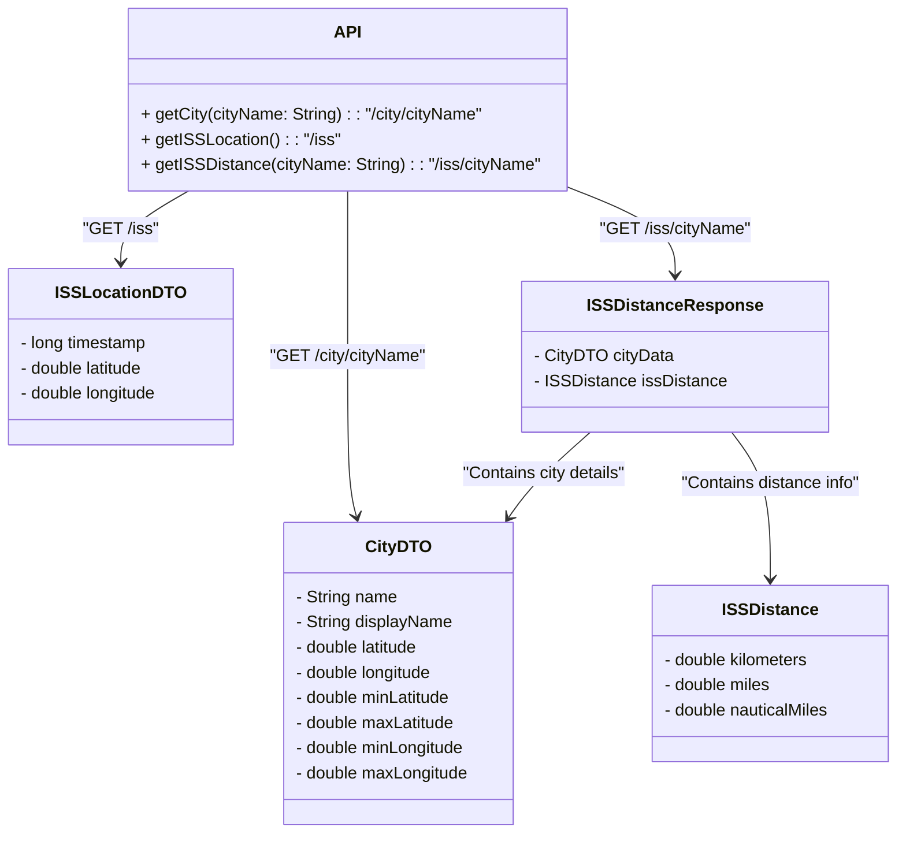

# Demo SpringBoot Application for DIO Lab Project on Design Patterns

This project is a Spring Boot application developed as a demo for the Digital Innovation One (DIO) Lab Project on Design Patterns. It provides RESTful endpoints to retrieve geographical coordinates for cities and calculate the distance between a given city and the current location of the International Space Station (ISS).

### Project Features

-   **City Information Endpoint:** Retrieves geographical coordinates for a given city and caches results in an in-memory database (H2).
-   **ISS Location Endpoint:** Provides the current location of the ISS.
-   **Distance Calculation:** Calculates the distance between a given city and the current ISS position.
----------

## Overview

This project demonstrates API integration, caching, and distance calculation using RESTful services. The endpoints leverage the following external APIs:

-   **Nominatim (OpenStreetMap):** Provides geolocation data for cities.
-   **OpenNotify ISS API:** Supplies real-time coordinates for the ISS.

## Class Diagram

## Endpoints

### 1. **GET /city/{cityName}**

-   Retrieves coordinates and details for a specified city from the [Nominatim OpenStreetMap API](https://nominatim.openstreetmap.org/search).
-   Caches the response in an H2 in-memory database to minimize external API calls.

**Example Request:**

    GET /city/Curitiba
    
**Example Response:**

    {
        "message": "Success",
        "status_code": 200,
        "data": {
            "name": "Curitiba",
            "display_name": "Curitiba, Região Geográfica Imediata de Curitiba, Região Metropolitana de Curitiba, Região Geográfica Intermediária de Curitiba, Paraná, Região Sul, Brasil",
            "latitude": -25.4295963,
            "longitude": -49.2712724,
            "min_latitude": -25.6435043,
            "max_latitude": -25.3450768,
            "min_longitude": -49.38914,
            "max_longitude": -49.1843182
        }
    }

### 2. **GET /iss**

-   Returns the current geographical location of the ISS using the OpenNotify ISS API.

**Example Request:**

    GET /iss
    
**Example Response:**

    {
        "message": "Successs",
        "status_code": 200,
        "data": {
            "timestamp": 1731653080,
            "iss_position": {
                "longitude": 177.1061,
                "latitude": 42.3922
            }
        }
    }

### 2. **GET /iss/{cityName}**

-   Retrieves the coordinates of the specified city from the OpenStreetMap API and the ISS's current location, then calculates the distance between the two.
-   Distance is provided in kilometers, miles, and nautical miles.

**Example Request:**

    GET /iss/Curitiba
    
**Example Response:**

    {
        "message": "Success",
        "status_code": 200,
        "city_data": {
            "name": "Curitiba",
            "display_name": "Curitiba, Região Geográfica Imediata de Curitiba, Região Metropolitana de Curitiba, Região Geográfica Intermediária de Curitiba, Paraná, Região Sul, Brasil",
            "latitude": -25.4295963,
            "longitude": -49.2712724,
            "min_latitude": -25.6435043,
            "max_latitude": -25.3450768,
            "min_longitude": -49.38914,
            "max_longitude": -49.1843182
        },
        "iss_distance": {
            "kilometers": 4771.52700418316,
            "miles": 2964.888506116294,
            "nautical_miles": 2576.4194065977267
        }
    }

## Setup

### Prerequisites

-   **JDK 17**: Ensure JDK 17 is installed.

### Installation

1.  **Clone the Repository:**

      `git clone https://github.com/hstr0100/dio-lab-padroes-projeto-spring.git`
      `cd dio-lab-padroes-projeto-spring`

2.  **Install Dependencies:**

      `./mvnw clean install`

3.  **Run the Application:**

      `./mvnw spring-boot:run`

4.  **Access Endpoints:**

      Application will run by default at `http://localhost:8080.`

